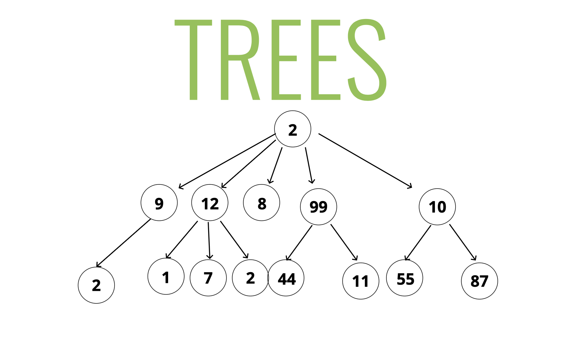
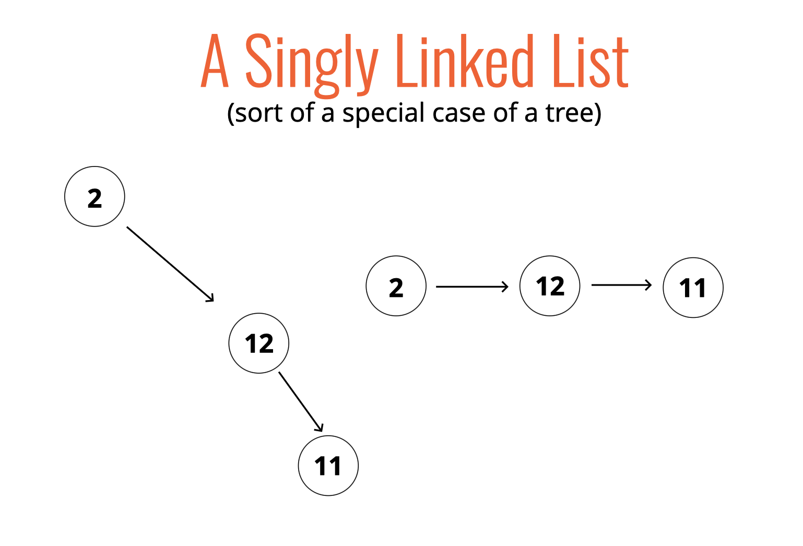
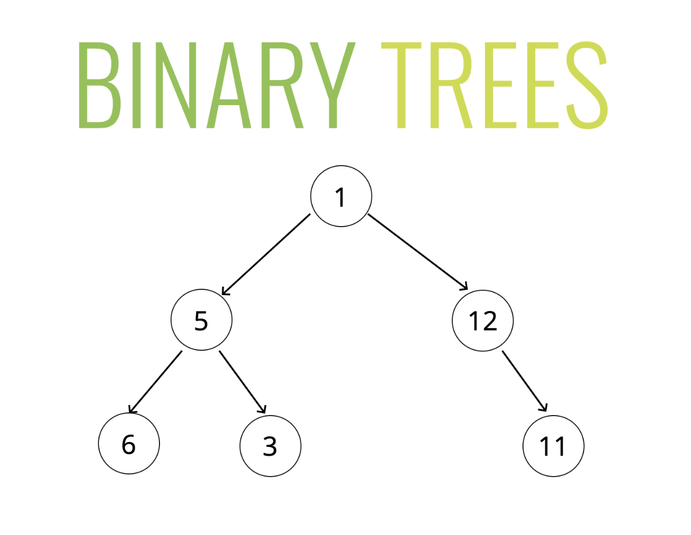
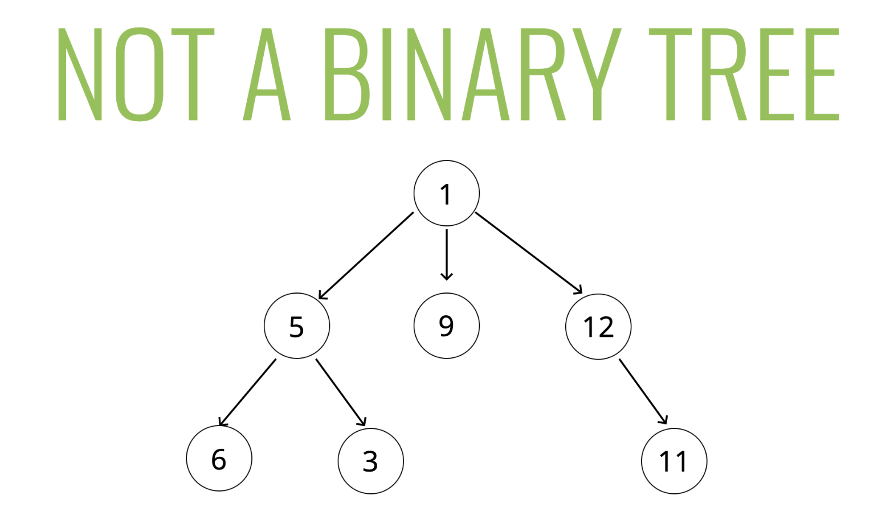
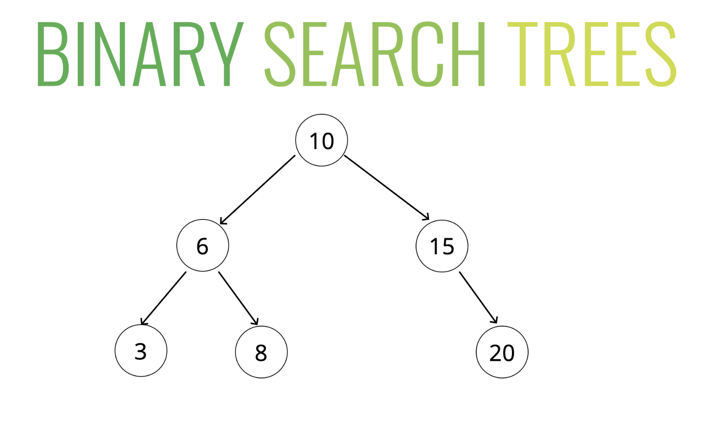

# **TREES**

## Table of Content
- [Object](#objectives)
- [What is a Tree](#what-is-a-tree)
- [Tree Terminology](#tree-terminology)
- [Kind of Tree](#kinds-of-trees)
- [Binary Tree](#binary-trees)
----


## **OBJECTIVES**

Define what a tree is 

Compare and contrast trees and lists  

Explain the differences between trees, binary trees, and binary search trees 

Implement operations on binary search trees


----

## **WHAT IS A TREE?**
A data structure that consists of nodes in a parent / child relationship



---

## **Note :**
**Lists** - linear

**Trees** - nonlinear

## A Special Case of Tree


----

## **TREE TERMINOLOGY**


1. ### **Root**   
    - The top node in a tree.  
2. ### **Child** 
    - A node directly connected to another node when moving away from the Root.  
3. ### **Parent** 
    - The converse notion of a child.  
4. ### **Siblings**  
    - A group of nodes with the same parent.  
5. ### **Leaf** 
    - A node with no children.  
6. ### **Edge** 
    - The connection between one node and another.


---

## **Kinds of Trees**
- Trees
- Binary Trees
- Binary Search Trees

## **Trees**
Lots of different applications!   
1. HTML DOM  
2. Network Routing  
3. Abstract Syntax Tree  
4. Artificial Intelligence  
5. Folders in Operating Systems
6. Computer File Systems  


## **Binary Trees**



### Binary Tree Example

Lots of different applications as well!  
- Decision Trees (true / false)
- Database Indicies
- Sorting Algorithms

---

## Not Binary Tree Example


----

## **BINARY SEARCH TREES**

### HOW BSTS WORK
- Every parent node has at most two children
- Every node to the left of a parent node is always less than the parent
- Every node to the right of a parent node is always greater than the parent




---

## The BinarySearchTree Class

```js
class BinarySearchTree {
    constructor(){
        this.root = null;
    }
}
```

```js
class Node {
    constructor(value){
        this.value = value;
        this.left = null;
        this.right = null;
    }
}
```

## **Inserting a node**

- Steps - Iteratively or Recursively
- Create a new node
- Starting at the root
    - Check if there is a root, if not - the root now becomes that new node!
    - If there is a root, check if the value of the new node is greater than or less than the value of the root
    - If it is greater 
        - Check to see if there is a node to the right
        - If there is, move to that node and repeat these steps
        - If there is not, add that node as the right property
    - If it is less
        - Check to see if there is a node to the left
        - If there is, move to that node and repeat these steps
        - If there is not, add that node as the left property