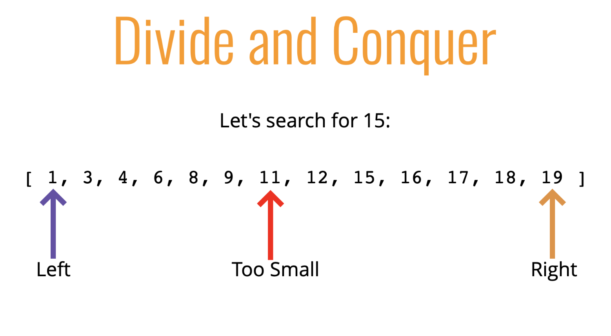
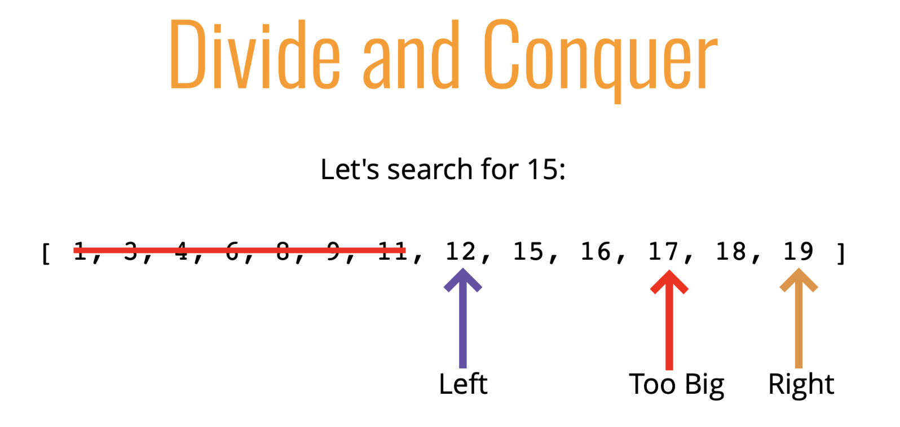
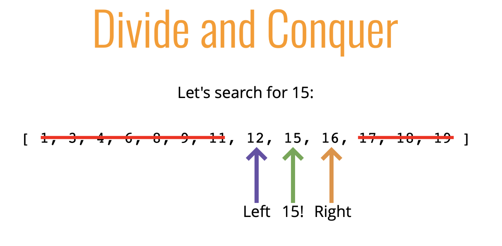

# **Binary Search**

Binary search is a much faster form of search
Rather than eliminating one element at a time, you can eliminate half of the remaining elements at a time
Binary search only works on sorted arrays!

---

## **Divid and Conquer**







## **Binary Search Pseudocode**

- This function accepts a sorted array and a value
- Create a left pointer at the start of the array, and a right pointer at the end of the array
- While the left pointer comes before the right pointer:
- Create a pointer in the middle
- If you find the value you want, return the index
- If the value is too small, move the left pointer up
- If the value is too large, move the right pointer down
- If you never find the value, return -1

```js
const binearySearch = (arr, elem) => {
  let start = 0;
  let end = arr.length - 1;
  let middle = Math.floor((start + end) / 2);

  while (arr[middle] !== elem) {
    if (elem < arr[middle]) end = middle - 1;
    else start = middle + 1;

    middle = Math.floor((start + end) / 2);
  }
  return arr[middle] === elem ? middle : -1;
};

console.log(binearySearch([2, 3, 4, 5, 6, 8, 9, 12, 23, 45, 67], 5));
```
