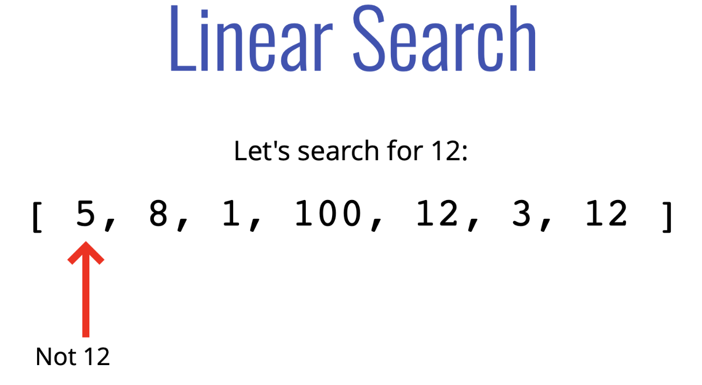
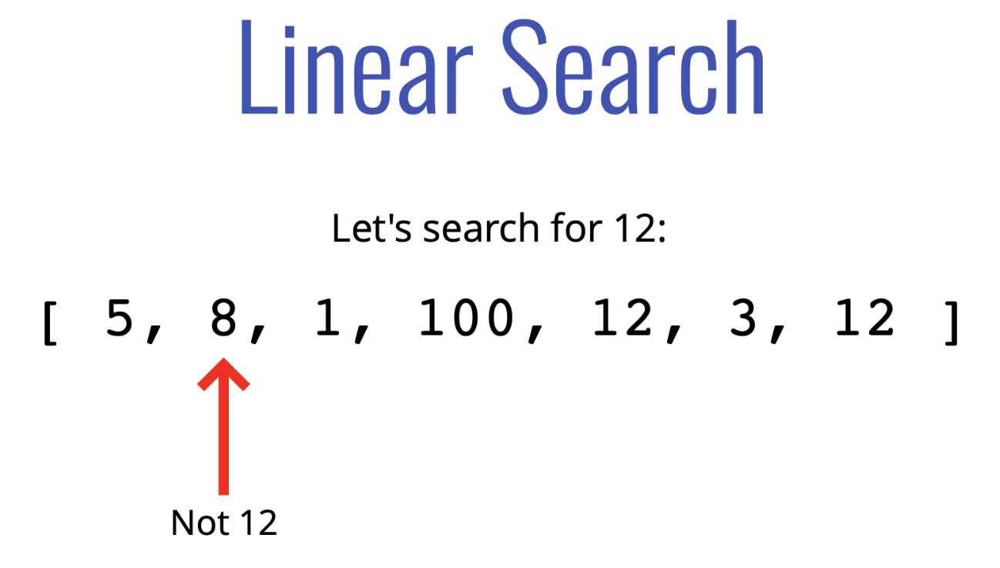
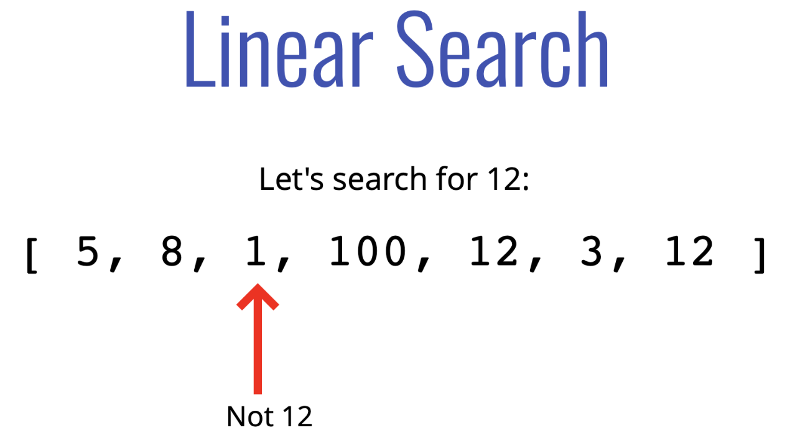
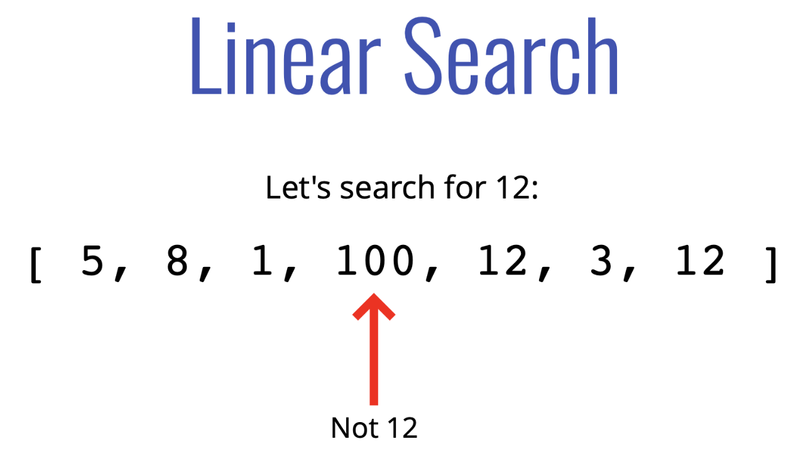
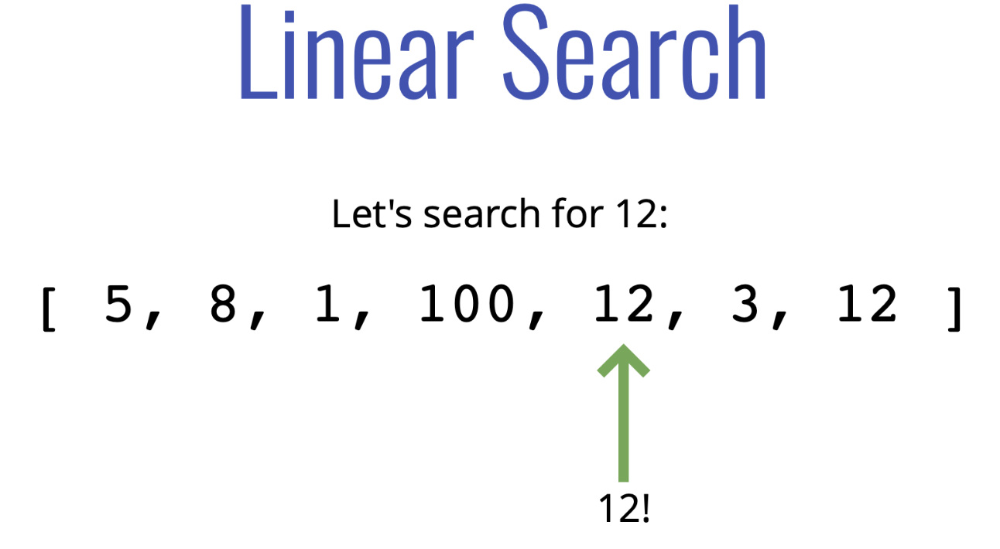

# **Linear Search**


Example:

<!--  -->


<!--  -->


<!--  -->


<!--  -->


<!--  -->


## Linear Search Pseudocode
- This function accepts an array and a value
- Loop through the array and check if the current array element is equal to the value
- If it is, return the index at which the element is found
- If the value is never found, return -1


```js
const linearSearch = (arr,val)=>{

    for (let i = 0; i < arr.length; i++) {
        if(arr[i]===val)return i;
    }
    return -1;
}

linearSearch([12,23,34,45,56,67,78,89,20],200);
```


---

## **Big O**

## Linear Search   
BIG O

1. Best  : `O(1)`
2. Average : `O(n)`
3. Worst : `O(n)`